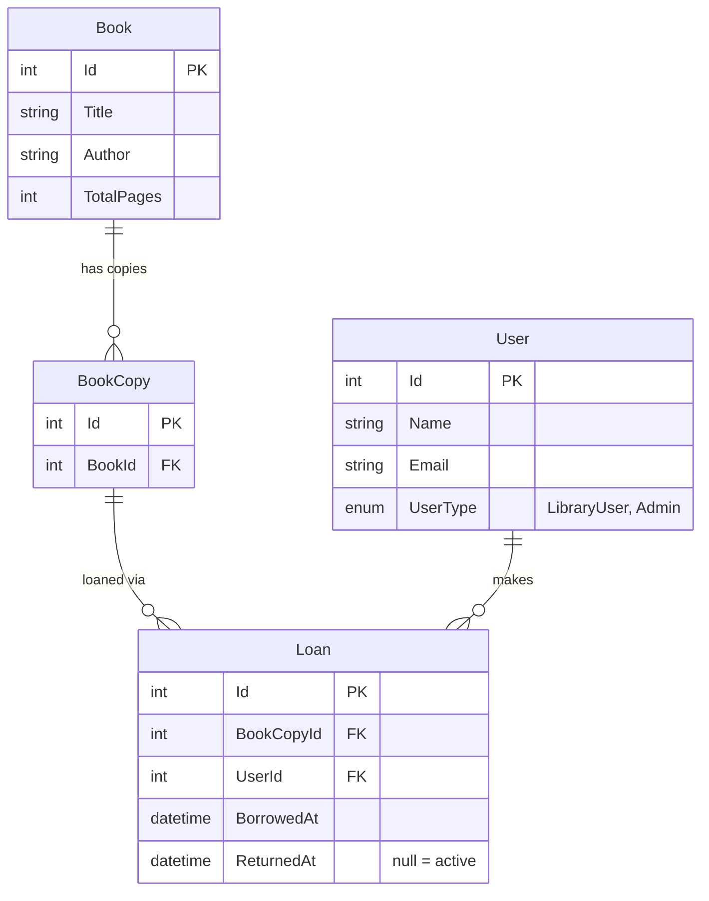

# Frenda Bibliotek — Implementation Plan

This document outlines the architecture, data model, and API design for the Frenda Bibliotek fullstack application.

## Stack
- **Backend**: .NET 7 Web API + Entity Framework Core (PostgreSQL)
- **Frontend**: Next.js 14 (App Router, TypeScript)
- **Infrastructure**: Docker Compose (orchestrating db, api, and frontend)

## Infrastructure Overview

The platform runs via a single `docker compose up` command.

### Services
1. **db**: PostgreSQL 16 (Alpine). Persistent volume, credentials via `.env`.
2. **api**: .NET Web API (port 5000). Waits for a db healthcheck, then applies migrations on startup.
3. **frontend**: Next.js (port 3000). Proxies `/api/*` requests to the `api` service.

### Database Migrations
EF Core migrations are generated with `dotnet ef migrations add` and committed to source control. On startup, the API calls `db.Database.Migrate()` to apply any pending migrations before the app begins serving requests. Seed data runs immediately after, only if the database is empty.

---

## Data Model (ERD)

A `Book` holds title-level metadata. Each physical copy is a `BookCopy`. A `Loan` links a `BookCopy` to a `User` — an active loan has `ReturnedAt = null`. `UserType` makes the model extensible for future roles (e.g. `Admin`) without schema changes.

---

## API Design

The API is mounted at `/api`. All requests that require a user context expect an `X-User-Id` header. This simulates authentication — no real login is required.

### Books

| Method | Path | Description |
|---|---|---|
| `GET` | `/api/books` | All books with live availability: total copies, available copies, active loan count, and estimated reading time. |
| `GET` | `/api/books/{id}` | Full book detail including availability, reading time estimate, and a list of recommendations. |
| `GET` | `/api/books/top` | Top 10 most-borrowed books, ranked by total loan count. |

### Loans

| Method | Path | Description |
|---|---|---|
| `GET` | `/api/loans` | Active and historical loans for the current user (identified via `X-User-Id`). |
| `POST` | `/api/loans` | Borrow an available copy of a book. Body: `{ "bookId": int }`. Returns `409` if no copies are available. |
| `PATCH` | `/api/loans/{id}/return` | Mark an active loan as returned. Returns `403` if the loan belongs to a different borrower, `409` if already returned. |

### Borrowers

| Method | Path | Description |
|---|---|---|
| `GET` | `/api/users` | Lists all users. Used by the frontend user-switcher to populate the dropdown. |

---

## Core Features

### Browse Books
`GET /api/books` returns all books in the library. Each entry includes the book's metadata alongside live availability data: total number of copies, how many are currently available, how many are on loan, and the estimated reading time. The frontend renders these as a browsable grid on the home page.

### Availability
Availability is computed at query time by counting `BookCopy` records that have no active loan (`ReturnedAt IS NULL`). This means availability reflects the real-time state of the library without any denormalised counters to keep in sync.

### Reading Time Estimation
Computed dynamically as `AVG(ReturnedAt - BorrowedAt)` across all completed loans for a given book. Returned as a number of days. If no loans have been returned yet, the field is `null` and the UI handles this gracefully.

### Borrow a Book
1. Begin a database transaction.
2. Find the first `BookCopy` for the given `bookId` with no active loan (`ReturnedAt IS NULL`).
3. If no copy is available → `409 Conflict`.
4. Create a `Loan` record with `BorrowedAt = UtcNow`.
5. Commit the transaction.

The transaction prevents two concurrent requests from claiming the same last available copy.

### Return a Loan
1. Verify the loan exists → `404` if not found.
2. Verify the loan belongs to the requesting user → `403` if not.
3. Verify the loan is still active → `409` if already returned.
4. Set `ReturnedAt = UtcNow` and save.

### My Loans
`GET /api/loans` returns all loans for the current user, split into two groups: active loans (where `ReturnedAt IS NULL`) and loan history (where `ReturnedAt` is set). The frontend displays these in two separate tabs on the `/loans` page, with a return button on each active loan.

### Top List
`GET /api/books/top` returns the 10 books with the highest total loan count across all borrowers and all time. The query aggregates loan counts across all copies of each book (since a book can have multiple `BookCopy` records). Displayed on the `/top` page.

### Recommendations
`GET /api/books/{id}` includes a `recommendations` list powered by a collaborative-filtering query:
1. Find all borrowers who have ever loaned the current book.
2. Find other books those borrowers have also loaned.
3. Rank those books by the number of shared borrowers (descending).
4. Return the top 5, excluding the current book.

---

## Frontend Pages

| Route | Purpose |
|---|---|
| `/` | Book browser — grid of all books with availability badges and reading time |
| `/books/[id]` | Book detail — full info, borrow button, reading time, recommendations |
| `/loans` | My loans — active loans with a return button, and loan history |
| `/top` | Top list — most borrowed books ranked by total loan count |

The `UserSwitcher` component lives in the global layout and allows switching the active user. It persists the selection to `localStorage` and injects the `X-User-Id` header into every API request.

---

## Seed Data

The database is pre-populated on first startup to ensure the top list and recommendations are immediately functional:

- ~10 books across different genres
- 2–3 physical copies per book
- ~8 users (with `UserType = LibraryUser`)
- ~45 completed loans distributed across borrowers and books
- A small number of active loans for the default demo user

---

## Testing

Integration tests use **Testcontainers** to spin up a real, ephemeral PostgreSQL instance for each test run. This ensures tests run against an environment identical to production, with no mocking of the database layer.
